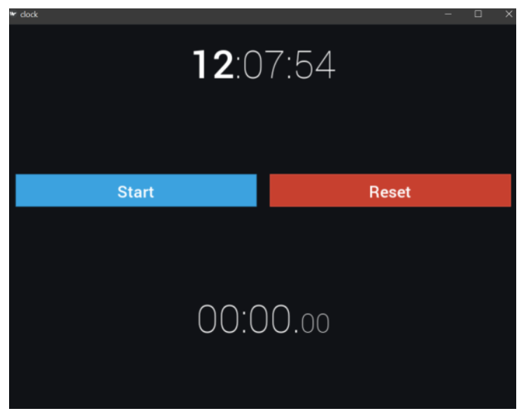

# Clock Application With Python

I've built a simple Clock app with python using the kivy module in python, similar in concept to the built-in application found in both iOS and Android using the Python Kivy language.
The code is equally split between a Python source code and a Kivy language (.kv) interface definition file.<br>

If you like this, then feel free to give it a star.⭐<br>

**Loading custom fonts**
For this particular app, we only need two styles: a lighter one `(Roboto-Thin.ttf)` and a heavier one `(Roboto-Medium.ttf)`, which we assign to `fn_regular` and `fn_bold` respectively:
```bash
from kivy.core.text import LabelBase
LabelBase.register(name='Roboto',
    fn_regular='Roboto-Thin.ttf',
    fn_bold='Roboto-Medium.ttf')
```
```bash
# In clock.kv
Label:
    text: '00:00:00'
    font_name: 'Roboto'
    font_size: 60
```

**Formatting text**
To achieve the desired formatting (hours in bold and the rest of the text in fn_regular thin font), we can use the following code:
```bash
Label:
    text: '[b]00[/b]:00:00'
    markup: True
```

**Changing bg color**
In this section, we will adjust the window background color. Window background (the “clear color” of OpenGL renderer) is a property of a global Window object. In order to change it, we add this code right after the `__name__ == ‘__main__’` line in main.py:
```bash
from kivy.core.window import Window
from kivy.utils import get_color_from_hex
Window.clearcolor = get_color_from_hex('#101216')
```

**Making the clock tick**
To access the Label widget that holds time, we will give it a unique identifier (id). Later, we can easily look up widgets based on their id property—again, a concept which is very similar to web development.
Modify clock.kv by adding the following:
```bash
Label:
    id: time
```
That’s it! Now we can access this Label widget from our code directly using the root.ids.time notation (root in our case is BoxLayout).

Updates to the ClockApp class include the addition of a method to display time, update_time, which looks like this:
```bash
def update_time(self, nap):
    self.root.ids.time.text = strftime('[b]%H[/b]:%M:%S')
```
Now let’s schedule the update function to run once per second after the
program starts:
```bash
def on_start(self):
    Clock.schedule_interval(self.update_time, 1)
```

**Binding widgets using properties**
Instead of hardcoding an ID for each widget that we need to access from Python code, we can also create a property and assign it in a Kivy language file. The motivation for doing so is mostly the DRY principle and cleaner naming, at a cost of a few more lines of code.
Such a property can be defined as follows:
```bash
# In main.py
from kivy.properties import ObjectProperty
from kivy.uix.boxlayout import BoxLayout
class ClockLayout(BoxLayout):
   time_prop = ObjectProperty(None)
```
Additionally, in the Kivy language file, clock.kv, we have to bind this property to a corresponding id. Custom properties look and behave no different from the default ones and use exactly the same syntax:
```bash
ClockLayout:
    time_prop: time
    Label:
        id: time
```

**Finalizing layout of Python clock App**
Stacking three widgets into BoxLayout normally makes every widget a third of the available size. Since we don’t want buttons to be this big compared to clock displays, we can add a height property to the horizontal (inner) BoxLayout and set its vertical size_hint property to None.

After updating the clock.kv file to account for stopwatch display and controls, it should look similar to the following (note the hierarchy of the layouts):
```bash
BoxLayout:
    orientation: 'vertical'
    Label:
        id: time
        text: '[b]00[/b]:00:00'
        font_name: 'Roboto'
        font_size: 60
        markup: True
    BoxLayout:
        height: 90
        orientation: 'horizontal'
        padding: 20
        spacing: 20
        size_hint: (1, None)
        Button:
            text: 'Start'
            font_name: 'Roboto'
            font_size: 25
            bold: True
        Button:
            text: 'Reset'
            font_name: 'Roboto'
            font_size: 25
            bold: True
    Label:
        id: stopwatch
        text: '00:00.[size=40]00[/size]'
        font_name: 'Roboto'
        font_size: 60
        markup: True
```

**Named classes**
One obvious problem with the straightforward approach to classes described earlier is that we can only have one class named Label. As soon as we need two different sets of properties applied to the same kind of widget, we have to define our own custom classes for them. Additionally, overwriting the framework’s built-in classes, such as Label or Button, may have undesired consequences throughout the application, for example, if another component is using the widget we’ve altered under the hood.

Fortunately, this is very simple to solve. Let’s create a named class for buttons, RobotoButton:
```bash
<RobotoButton@Button>:
    font_name: 'Roboto'
    font_size: 25
    bold: True
```
The part before the @ symbol designates the new class name, followed by the widget type we’re extending (in Python, we would say class RobotoButton(Button): instead). The resulting class can be then used in the Kivy language instead of the generic Button class:
```bash
RobotoButton:
    text: 'Start'
```

**Styling buttons**
One of the darker corners of the flat UI paradigm is the look of clickable elements, like that of buttons; there is no universally accepted way of styling them.

Kivy is flexible in this regard. The framework does not impose any restrictions on visuals and provides a number of useful features to implement any design you like. One of the utilities that we will discuss next is 9-patch image scaling, which is used to style buttons and similar widgets that may have borders.

Now, to apply the 9-patch magic, we need to tell Kivy the size of borders that have limited scalability, as discussed previously (the image will be scaled uniformly by default). Let’s revisit the clock.kv file and add the following properties:
```bash
<RobotoButton@Button>:
    background_normal: 'button_normal.png'
    background_down: 'button_down.png'
    border: (2, 2, 2, 2)
```
This can be used to selectively override background_*, border or any other attribute, for example, assigning another texture while reusing the border width definition:
```bash
RobotoButton:
    text: 'Reset'
    background_normal: 'red_button_normal.png'
    background_down: 'red_button_down.png'
```

**Counting time**
For the task of creating a stopwatch, we will need to build our own, non-monotonic time counter first. This is easily achieved without using Python’s time functions altogether, thanks to Kivy’s Clock.schedule_interval event handler that accepts the time passed between calls as a parameter. This is just what the nap parameter
does in the following code:
```bash
def on_start(self):
   Clock.schedule_interval(self.update, 0.016)
def update(self, nap):
   pass
```
Time is measured in seconds, that is, if the app is running at 60 fps and calls our function every frame, the average nap will be 60−1 = 0.016(6)

With this parameter in place, keeping track of the time passed is simple and can be achieved with a simple increment:
```bash
class ClockApp(App):
   sw_seconds = 0
    def update(self, nap):
       self.sw_seconds += nap
```

### Putting a stopwatch in place

```bash
def update_time(self, nap):
   self.sw_seconds += nap
    minutes, seconds = divmod(self.sw_seconds, 60)
  self.root.ids.stopwatch.text = (
     '%02d:%02d.[size=40]%02d[/size]' %
      (int(minutes), int(seconds),
       int(seconds * 100 % 100)))
Clock.schedule_interval(self.update_time, 0)
```

### Stopwatch controls in Python Clock app

```bash
def start_stop(self):
    self.root.ids.start_stop.text = ('Start'
        if self.sw_started else 'Stop')
    self.sw_started = not self.sw_started
def reset(self):
    if self.sw_started:
      self.root.ids.start_stop.text = 'Start'
      self.sw_started = False
    self.sw_seconds = 0
```
We also need to add the state property to keep track of whether the stopwatch is running or paused:
```bash
class ClockApp(App):
    sw_started = False
    sw_seconds = 0
    def update_clock(self, nap):
        if self.sw_started:
            self.sw_seconds += nap
```

### Output

